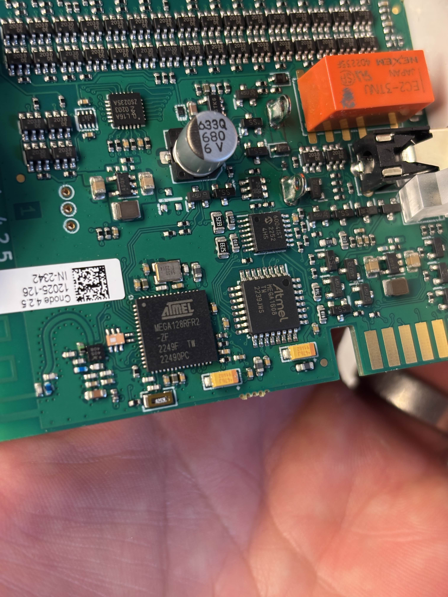

# Background
Ngenic Tune is an IoT device that makes heat pumps and other heating systems smarter by adjusting the heat level with an advanced control algorithm to optimize comfort and electricity cost. Ngenic, a Swedish company, was founded in 2010 and Tune was their first product. Initially, the business model was to buy the hardware for a one-time cost and then the app and cloud services were included for free. On April 25 2025, Ngenic went bankrupt after a long struggle and later in 2025 a new company was founded that took over the customer base. During the summer of 2025 it was announced that the cloud services would be put behind a paywall so that all existing customers would need to pay a monthly subscription fee to continue using the service.

Ngenic Tune is not a cheap product with the company charging several thousand SEK (hundreds of EUR) upfront for the hardware. During the bankruptcy, users were concered about such an expensive piece of equipment being fully reliable on a cloud service to provide its basic functionality. Before the subcription service was announced, it was feared that the hardware would become worthless if the cloud services shut down. Therefore, an investigation was started by enthusiasts to investigate if the hardware can be hacked to work without the subscription.

# Goals
* Understand the hardware and software running on the Ngenic Tune box
* Understand the communication protocol between the devices
* Allow the Ngenic Tune box to function without cloud services

Likely we will not be able to replicate the whole experience including the app, so the target audience is the technical user who is comfortable creating automations in Home Assistant or Homey 

# Hardware
The kit consists of three parts: Gateway, Controller, and Temperature Sensor. 

## Gateway
The Gateway is an internet-connected and mains-powered device that communicates with the Controller and Temperature Sensor. It is connected to the Internet and talks to the cloud services and tells the Controller what level to set the temperature adjustment to.

## Controller
The Controller is a battery-powered device that is connected to the heater. It takes input from the heater's own outdoor temperature sensor and modifies the signal so that the heater increases or decreases the heat level depending on the control algorithm

The Controller board consists of an array of resistors used to simulate an n10k thermistor, a microcontroller, and a radio module. The Controller is powered by two AA batteries and communicates with the Gateway using a protocol similar to Zigbee.

The microcontroller is an Atmel ATMEGA128RFR2-ZF. There is a secondary microcontroller as well, an Atmel ATMEGA1608.

# Wireless communication
The Gateway and Controller communicate wirelessly using a proprietary protocol that is similar to Zigbee. The hardware appears to use off the shelf Zigbee modules but the protocol is intentionally modified to prevent the use of standard Zigbee software. 

## Temperature Sensor
The Temperature Sensor is a battery-powered device that reads the temperature and humidity indoors and sends the data to the Gateway. It is very similar to other IoT devices used in smart home control systems to tell the temperature.

# Links
* (FB) Tune Hacks group: https://www.facebook.com/groups/3964776607185977
* (FB) Ngenic Community group (Swedish): https://www.facebook.com/groups/1133747714210165
* Discord: https://discord.gg/VzE53PgEjR
* Discussion thread on byggahus.se: https://www.byggahus.se/forum/threads/ngenic-teardown.552881/
* Official Ngenic GitHub: https://github.com/ngenic
* Ngenic: https://ngenic.se/

# Legal
This project is not affiliated with Ngenic in any way. All trademarks belong to the respective owners.

# Appendix: Thermistor values
The controller simulates a thermistor so that the heater can read the temperature. In this table, we give the values for an N10K thermistor as taken from the manual of the IVT Greenline HT+ heat pump. Note that Ngenic Tune is compatible with a wide range of heat pumps and these values can be different for other models.

| Temperatur (ºC) | kOhm   |
|-----------------|--------|
| -40             | 154.300|
| -35             | 111.700|
| -30             | 81.700 |
| -25             | 60.400 |
| -20             | 45.100 |
| -15             | 33.950 |
| -10             | 25.800 |
| -5              | 19.770 |
| 0               | 15.280 |
| 5               | 11.900 |
| 10              | 9.330  |
| 15              | 7.370  |
| 20              | 5.870  |
| 25              | 4.700  |
| 30              | 3.790  |
| 35              | 3.070  |
| 40              | 2.510  |
| 45              | 2.055  |
| 50              | 1.696  |
| 55              | 1.405  |
| 60              | 1.170  |
| 65              | 0.980  |
| 70              | 0.824  |
| 75              | 0.696  |
| 80              | 0.590  |
| 85              | 0.503  |
| 90              | 0.430  |